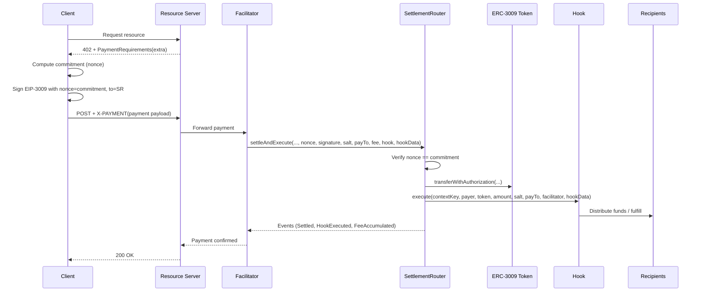

# x402-exec — Programmable Settlement for x402

## Abstract

x402-exec extends the x402 payment protocol with programmable settlement. It binds payment verification, business logic execution, and facilitator incentives into a single atomic transaction using EIP-3009. The core primitive is a commitment-based nonce: a cryptographic hash of all settlement parameters becomes the EIP-3009 nonce. This prevents parameter tampering, enables stateless processing by facilitators, and unlocks rich post-payment workflows (revenue split, NFT mint, loyalty rewards) without sacrificing x402 compatibility or client simplicity.

## Motivation

- Payments often require post-transfer actions: split revenue to multiple parties, mint or fulfill digital goods, distribute loyalty points, or apply referral rewards.
- Pure routing cannot guarantee atomicity across payment and fulfillment. Partial success creates disputes and operational risk.
- Facilitators need a native, transparent incentive mechanism to operate permissionlessly.

x402-exec addresses these by:
- Executing payment verification and hook-driven business logic atomically in one transaction.
- Cryptographically binding parameters to the user’s signature via a commitment-as-nonce scheme.
- Accounting and emitting events for facilitator fees.

## System Model

- Actors: Client, Resource Server, Facilitator, SettlementRouter (on-chain), Hook(s), Recipients, ERC-3009 Token (e.g., USDC).
- Transport: HTTP 402 negotiation; final request carries `X-PAYMENT` header (base64url PaymentPayload).
- Trust: No trusted intermediary. Integrity derives from EIP-712 signatures and on-chain verification; visibility via events.

## Architecture Overview

```mermaid
flowchart TD
  C[Client] -->|402 negotiation| RS[Resource Server]
  RS -->|PaymentRequirements (extra)| C
  C -->|X-PAYMENT header| RS
  RS --> F[Facilitator]
  F -->|settleAndExecute| SR[SettlementRouter]
  SR -->|verify commitment| SR
  SR -->|transferWithAuthorization| T[ERC-3009 Token]
  SR -->|execute| H[ISettlementHook]
  H --> R[Recipients]
  SR --> E[Events]

  style SR fill:#e1f5fe
  style H fill:#fff4e1
  style R fill:#e8f5e9
```

### Core Components

- SettlementRouter: Verifies commitment, consumes EIP-3009 authorization, accumulates facilitator fee, approves and invokes Hooks, enforces no-fund-holding invariant, and emits events.
- ISettlementHook: Minimal interface to implement arbitrary business logic that consumes funds made available by the Router.
- Facilitator: Relays `PaymentPayload`, selects Router vs. direct transfer path, pays gas, and claims fees.

## Protocol Primitive: Commitment-as-Nonce

Let the client compute the commitment:

```
nonce = H(
  "X402/settle/v1",
  chainId,
  hub /* SettlementRouter address */,
  token,
  from,
  value,
  validAfter,
  validBefore,
  salt,
  payTo,
  facilitatorFee,
  hook,
  H(hookData)
)
```

The client then signs EIP-3009 TransferWithAuthorization with `nonce` set to the above commitment and `to` set to `hub` (SettlementRouter). On-chain, SettlementRouter recomputes the same hash and rejects any mismatch. Thus, all business parameters (router, hook, recipients, fees, salt, timing) are bound to the user’s signature.

### PaymentRequirements Extension

The `extra` section carries settlement parameters required for complex flows:

```
extra = {
  settlementRouter, // hub
  salt,             // bytes32 per-settlement uniqueness
  payTo,            // final recipient (transparency/UI)
  facilitatorFee?,  // optional
  hook,             // hook contract
  hookData          // ABI-encoded params
}
```

Clients MAY include the full `paymentRequirements` in the `PaymentPayload` to enable stateless facilitators. When `settlementRouter` is absent, clients fall back to standard x402 (random nonce, direct transfer to payTo).

## End-to-End Flows

### Settlement with Router and Hook



## Security Model

- Atomicity: Router verifies commitment, consumes authorization, executes hook, and checks no-fund-holding in a single transaction. All-or-nothing.
- Integrity: Any parameter tampering changes the commitment; Router rejects on mismatch.
- Idempotency: `contextKey = H(from, token, nonce)` prevents duplicate settlement.
- Replay Protection: EIP-3009 nonce uniqueness + per-settlement `salt`.
- Reentrancy: Guarded via OpenZeppelin ReentrancyGuard and CEI.
- No Fund Holding: Router enforces post-execution balance equals pre-transfer plus accumulated fees.

## Economic Incentives (Facilitators)

- Facilitator fee is accounted on-chain (`pendingFees[facilitator][token]`) and emitted via events.
- Fees are claimable at any time via `claimFees`.
- Transparent incentives enable a permissionless facilitator market without out-of-band arrangements.

## Comparison: x402 vs. x402-exec

- Payment Primitive:
  - x402: EIP-3009 `transferWithAuthorization` directly to merchant.
  - x402-exec: EIP-3009 to SettlementRouter, which verifies commitment and executes hooks.
- Extensibility:
  - x402: Payment routing.
  - x402-exec: Arbitrary hook-driven settlement (split, mint, rewards, etc.).
- Integrity Binding:
  - x402: Nonce ensures uniqueness but does not bind business parameters.
  - x402-exec: Commitment-as-nonce binds router, hook, recipients, fee, salt, and timing.
- Facilitator Incentives:
  - x402: Out-of-band.
  - x402-exec: Native, transparent on-chain fee accounting and claiming.
- Backward Compatibility:
  - x402-exec gracefully falls back to x402 when `extra.settlementRouter` is absent.

## Interoperability & Integration Notes

- Clients: Minimal changes (compute commitment when router present; include `paymentRequirements` in payload for stateless processing).
- Facilitators: Route to Router path when present; otherwise direct token call.
- Resource Servers: Generate settlement params and deterministic `salt`; encode `hookData`.

## Performance & Gas (Qualitative)

- Router path adds a contract hop and hook execution compared to direct transfers.
- Atomicity often replaces multi-call patterns, reducing complexity and failure modes.
- Events provide cheap observability for reconciliation.

## Limitations & Future Work

- Requires audited hooks and careful parameter encoding to avoid logic errors.
- Privacy: Carrying `paymentRequirements` in payload is optional; clients may choose not to include sensitive fields.
- Future: Formal verification of commitment binding and context key uniqueness; gas optimizations; production audits and mainnet deployments.

## References & Deployments

- Contract: `SettlementRouter.sol` (see repository contracts/src)
- Testnet (Base Sepolia): Router and example hooks deployed; see repository docs and showcase for addresses and scenarios.
- Related: x402 protocol, EIP-3009.

---

This lightpaper summarizes the rationale, design, and security properties of x402-exec. For API details and end-to-end code, see the How-It-Works guide and example facilitator/showcase in the repository.


